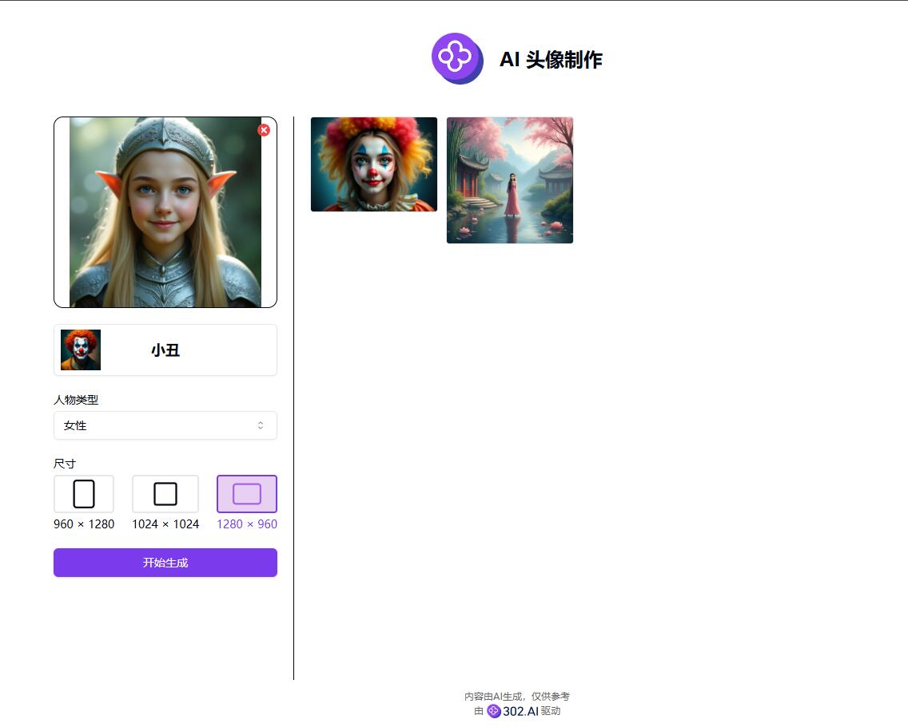
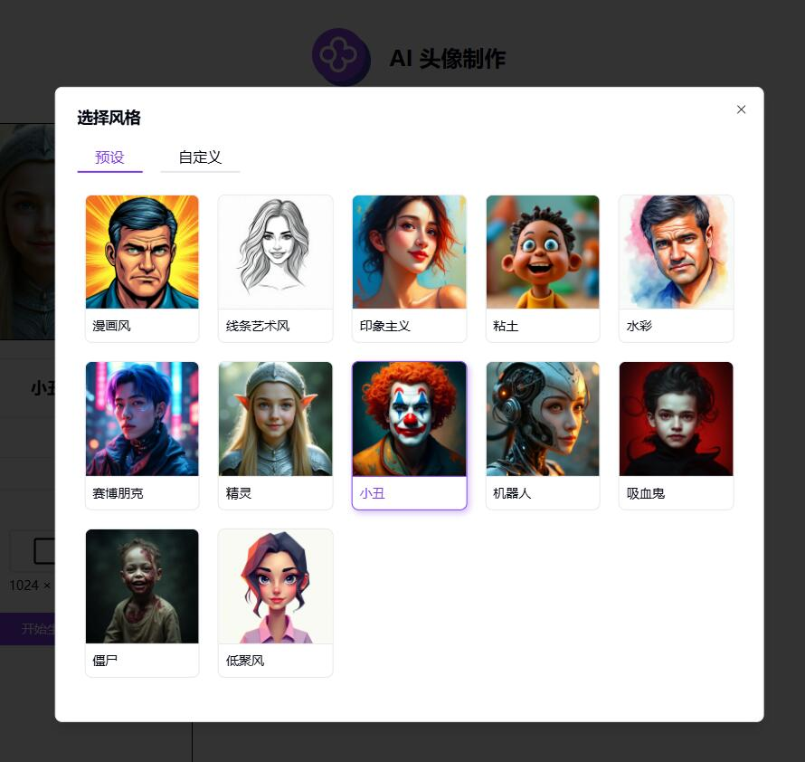

# 💻🤖 Welcome to 302.AI's AI Avatar Maker! 🚀✨

[中文](README_zh.md) | [English](README.md) | [日本語](README_ja.md)

The open-source version of [302.AI](https://302.ai) from [AI Avatar Maker](https://302.ai/tools/headshot/). 
You can directly log in to 302.AI to use the online version with zero code and zero configuration. 
Alternatively, you can modify this project according to your needs, input the API KEY from 302.AI, and deploy it yourself.

## ✨ About 302.AI ✨
[302.AI](https://302.ai) is a pay-as-you-go AI application platform that solves the last-mile problem of AI being used in practice.
1. 🧠 Integrates the latest and most comprehensive AI capabilities and brands, including but not limited to language models, image models, sound models, and video models.
2. 🚀 Deep application development on base models, creating real AI products rather than simple chatbots.
3. 💰 No monthly fee; all features are pay-as-you-go, fully open, achieving truly low entry barriers with high ceilings.
4. 🛠 Powerful management backend, suitable for teams and small to medium-sized enterprises, with one-person management and multi-user access.
5. 🔗 All AI capabilities provide API access; all tools are open source and customizable (in progress).
6. 💡 A strong development team, launching 2-3 new applications weekly, with daily product updates. Developers interested in joining are welcome to contact us.

## Project Features
1. 🛠️ Presets for various artistic styles: comic, watercolor, impressionism, cyberpunk, etc., supporting custom style descriptions and parameter adjustments.
2. 🖼️ Supports multiple image formats (PNG, JPG, JPEG, WEBP).
3. 📐 Multiple output size options: 960×1280, 1024×1024, 1280×960.
4. 🌙 Eye-friendly dark mode to protect your eye health.
5. 🌐 Full internationalization with support for switching between Chinese, English, and Japanese interfaces.

Create unique social media avatars, generate art-styled personal portraits, and build exclusive brand virtual images with AI Avatar Maker. 🎉💻 Let's explore the AI-driven new world of coding together! 🌟🚀

## Technology Stack
- Next.js 14
- Tailwind CSS
- Shadcn UI

## Development & Deployment
1. Clone the project: `git clone https://github.com/302ai/302_avatar_maker`
2. Install dependencies: `pnpm install`
3. Configure the 302 API KEY: see .env.example for reference
4. Run the project: `pnpm dev`
5. Build and deploy: `docker build -t coder-generator . && docker run -p 3000:3000 coder-generator`

## Interface Preview

