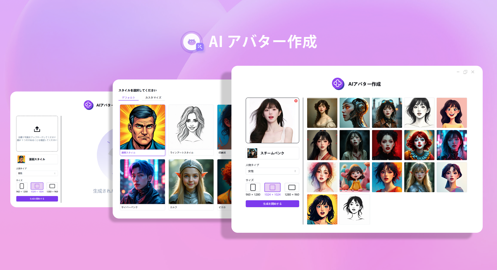
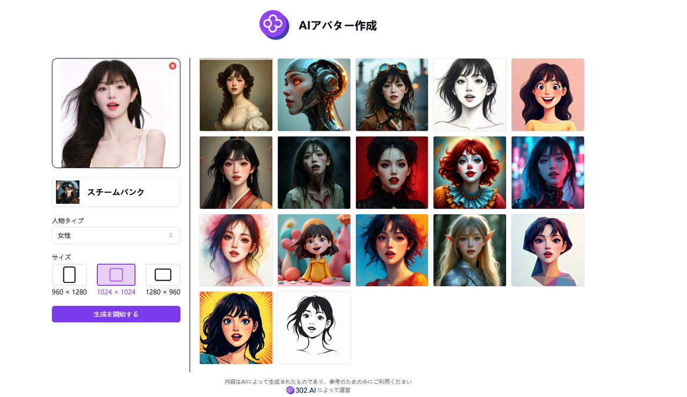

# 
🖼️ AIアバターの作成🚀✨

AI によるアバター作成では、自撮り写真をアップロードすることで、異なるスタイルのアバターを生成することができます。また、スタイルをカスタマイズすることもできます。

<a href="README_zh.md">中文</a> | <a href="README.md">English</a> | <a href="README_ja.md">日本語</a>

[302.AI](https://302.ai)からの[AIアバターメーカー](https://302.ai/ja/tools/headshot/)のオープンソース版です。
302.AIに直接ログインして、コードや設定なしでオンライン版を使用できます。
または、本プロジェクトをニーズに合わせて修正し、302.AIのAPIキーを入力して、自分でデプロイすることもできます。

## インターフェースプレビュー
複数のアバタースタイルがローンチされており、選択することができます。

## プロジェクトの特長
### 🛠️ 複数の事前設定されたアートスタイル
私たちはまた、スタイルの説明をカスタマイズし、パラメータを調整することもサポートしています。以下は事前設定されたスタイルです。
- 漫画風
- 線画アート風
- 印象派
- 粘土
- 水彩画
- サイバーパンク
- エルフ
- ピエロ
- ロボット
- 吸血鬼
- ゾンビ
- ローポリ風
- ヴィンテージポートレート
- 古風
- 漫画イラスト
- 鉛筆スケッチ風
- スチームパンク
### 🖼️ 複数の画像フォーマットをサポート
- PNG
- JPG
- JPEG
- WEBP
### 📐 複数の出力サイズをサポート
- 960×1280
- 1024×1024
- 280×960
### 🌙 配慮のあるダークモード
ダークモードを提供し、あなたの目の健康を守ります。
### 🌍 多言語サポート
- 中国語インターフェース
- 英語インターフェース
- 日本語インターフェース

AIアバターメーカーを通じて、ユニークなソーシャルメディアアバターを作成し、アートスタイルの個人肖像を生成し、ブランド専用のバーチャルイメージを構築します。🎉💻 AI駆動の新しいコーディングの世界を一緒に探求しましょう！🌟🚀

## 🚩 将来のアップデート計画
- [ ] アバターの事前設定スタイルを更新する
- [ ] 細部の精度を向上させる
- [ ] 五官と顔の特徴を最適化する

## 技術スタック
- Next.js 14
- Tailwind CSS
- Shadcn UI

## 開発とデプロイ
1. プロジェクトをクローン `git clone https://github.com/302ai/302_avatar_maker`
2. 依存関係をインストール `pnpm install`
3. 302のAPIキーを設定 .env.exampleを参考
4. プロジェクトを実行 `pnpm dev`
5. ビルドとデプロイ `docker build -t coder-generator . && docker run -p 3000:3000 coder-generator`

## ✨ 302.AIの紹介 ✨
[302.AI](https://302.ai)は、AIを実践に使用する際のラストマイル問題を解決する、従量制料金のAIアプリケーションプラットフォームです。
1. 🧠 言語モデル、画像モデル、音声モデル、ビデオモデルを含む、最新で最も包括的なAI機能とブランドを統合。
2. 🚀 基礎モデル上での深いアプリケーション開発を行い、単なるチャットボットではなく、本物のAI製品を開発。
3. 💰 月額料金なしで、すべての機能が従量制で全面的に開放されており、実際に低い参入障壁と高い上限を実現。
4. 🛠 強力な管理バックエンドは、チームや中小企業向けで、一人の管理者が複数のユーザーを管理可能。
5. 🔗 すべてのAI機能はAPI接続を提供し、すべてのツールがオープンソースでカスタマイズ可能（進行中）。
6. 💡 強力な開発チームが週に2〜3個の新アプリケーションを立ち上げ、製品を日々更新。参加に興味のある開発者も歓迎します。
