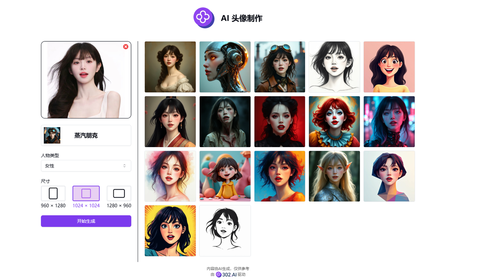
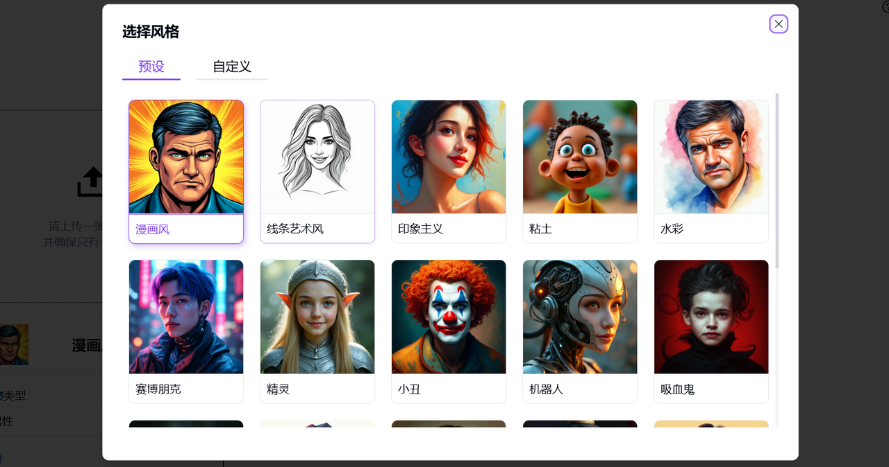
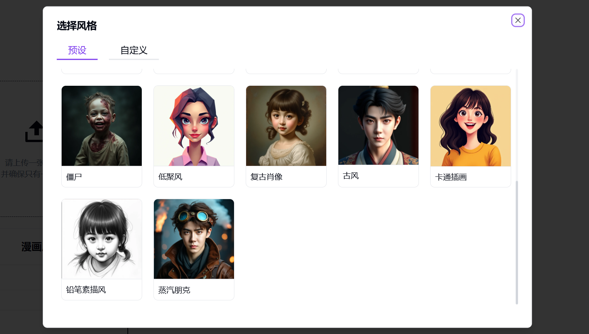

# 
🖼️ AI 头像制作 🚀✨

AI头像制作通过上传一张自拍照，生成不同风格的头像，还可以自定义风格。

<a href="README zh.md">中文</a> | <a href="README.md">English</a> | <a href="README_ja.md">日本語</a>

来自[302.AI](https://302.ai)的[AI 头像制作](https://302.ai/tools/headshot/)的开源版本。
你可以直接登录302.AI，零代码零配置使用在线版本。
或者对本项目根据自己的需求进行修改，传入302.AI的API KEY，自行部署。

## 界面预览

## 项目特性
### 🛠️ 预设多种艺术风格
我们也支持自定义风格描述和参数调整，以下是预设的风格：
  - 漫画风
  - 线条艺术风
  - 印象主义
  - 粘土
  - 水彩
  - 赛博朋克
  - 精灵
  - 小丑
  - 机器人
  - 吸血鬼
  - 僵尸
  - 低聚风
  - 复古肖像
  - 古风
  - 卡通插画
  - 铅笔素描风
  - 蒸汽朋克

### 🖼️ 支持多种图片格式
  - PNG
  - JPG
  - JPEG
  - WEBP

### 📐 支持多种输出尺寸
  - 960×1280
  - 1024×1024
  - 1280×960

### 🌙 贴心暗色
  提供暗色模式，呵护您的用眼健康。

### 🌍 多语言支持
  - 中文界面
  - English Interface
  - 日本語インターフェース

通过AI 头像制作,创建独特的社交媒体头像，生成艺术风格的个人肖像，打造品牌专属的虚拟形象。 🎉💻 让我们一起探索AI驱动的代码新世界吧! 🌟🚀

## 🚩 未来更新计划
- [ ] 更新头像预设风格
- [ ] 细节精准度提升
- [ ] 五官与面部特征优化
  
## 技术栈
- Next.js 14
- Tailwind CSS
- Shadcn UI

## 开发&部署
1. 克隆项目 `git clone https://github.com/302ai/302_avatar_maker`
2. 安装依赖 `pnpm install`
3. 配置302的API KEY 参考.env.example
4. 运行项目 `pnpm dev`
5. 打包部署 `docker build -t coder-generator . && docker run -p 3000:3000 coder-generator`

## ✨ 302.AI介绍 ✨
[302.AI](https://302.ai)是一个按需付费的AI应用平台，为用户解决AI用于实践的最后一公里问题。
1. 🧠 集合了最新最全的AI能力和品牌，包括但不限于语言模型、图像模型、声音模型、视频模型。
2. 🚀 在基础模型上进行深度应用开发，我们开发真正的AI产品，而不是简单的对话机器人
3. 💰 零月费，所有功能按需付费，全面开放，做到真正的门槛低，上限高。
4. 🛠 功能强大的管理后台，面向团队和中小企业，一人管理，多人使用。
5. 🔗 所有AI能力均提供API接入，所有工具开源可自行定制（进行中）。
6. 💡 强大的开发团队，每周推出2-3个新应用，产品每日更新。有兴趣加入的开发者也欢迎联系我们
